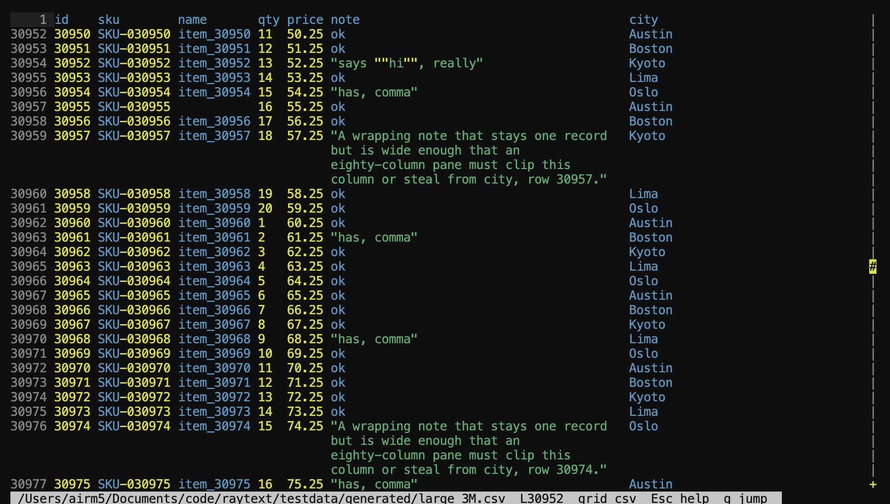
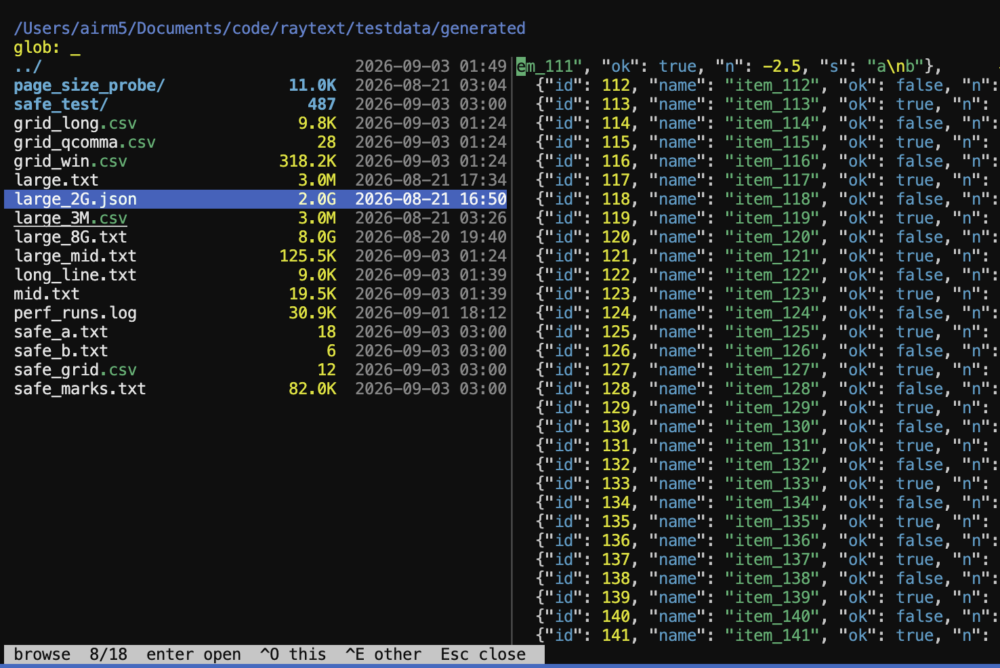

# cctext 0.1

A text editor in [Concurrent-C](https://github.com/sreekotay/concurrent-c) — a strict C11-superset preprocessor: `.ccs` lowers to plain C and compiles with your host C compile.

CCText has one document core, two frontends — **cctext** (POSIX console) and **cctext-gui** (Cocoa + Core Text).

This is a standalone app. Building from source needs `ccc` on `PATH` (or `CCC=`). Prebuilts ship on [GitHub Releases](https://github.com/sreekotay/cctext/releases) (no compiler): **cctext** on Linux and macOS, **cctext-gui** on macOS in the same tarball. It does not live inside the compiler repository.





## Getting started

Unpack a [release](https://github.com/sreekotay/cctext/releases) (no compiler) and run it in place:

```bash
tar -xzf cctext-macos-arm64.tar.gz
./cctext-macos-arm64/cctext --version
./cctext-macos-arm64/cctext            # file browser
./cctext-macos-arm64/cctext file.txt   # missing path asks to create
./cctext-macos-arm64/cctext-gui file.txt
```

From source: `./make.shcc @cctext` then `./bin/cctext` or `./bin/cctext file.txt`. `-h` / `--help` lists options; `-v` / `--version` prints `cctext 0.1`; `--no-blink` keeps a solid caret; `--backup` saves in place (keeps a symlink) and writes a dirty-span `path~` first; `--stats-json` prints the Esc/= engine stats as JSON on exit; `--batch` runs `-c` commands or a stdin script with no TTY (Safe journals off unless `--safe`). Save refuses if the opened file changed on disk (mtime + size + inode); the TUI/GUI asks overwrite / cancel. `--batch` save fails with `file changed on disk`.

## Features

- **Fast on huge files.** An 8 GiB open is 0.005 ms; first-screen scroll is 0.039 ms; `g 50%` is 0.005 ms. The body stays on disk (page store). The line cache is a growing prefix plus 32 pins at 1/32 file fractions — not a full-file index. Numbers, including syntax highlight: [Perf](#perf).
- **Small.** Release `cctext` is 471 KiB. Open RSS is ~1.5 MiB on 3 MiB and on 8 GiB.
- **UTF-8.** Caret, wrap, hit-test, and backspace walk UAX #29 extended grapheme clusters (ZWJ emoji, flags, combining marks). Hex stays a byte camera.
- **TUI and GUI.** Same document core: **cctext** (POSIX console) and **cctext-gui** (Cocoa + Core Text).
- **Hex / grid.** `Ctrl-L` cycles default → wrap → hex (offset | hex | UTF-8 dump) → grid (CSV/TSV/pipe columns).
- **Multiview.** Several files, splits, two cameras on one document. Unlock (`Ctrl-U`) lets a pane scroll off the caret.
- **File browser.** No filename opens it. `b` / `Ctrl-B` opens the listing into the focused view; `o` / `Ctrl-O` does the same. In the GUI, **File → Browse** is ⌘B (⌘O aliases it); **File → Open…** is the system dialog with no shortcut. The listing sits on the left; when the pane is wide enough the selection opens on the right as the same document core — recovered journal, camera, and view. See [Browse preview](#browse-preview). Click the preview or its byte-rail to open the file. In the browser, `Ctrl-O` / `Cmd-O` launches this frontend on the selection; `e` / `Ctrl-E` launches the other (`cctext` ↔ `cctext-gui`). A new **cctext** opens in the host terminal (Cursor when you launched from there; iTerm or Terminal.app otherwise). **cctext-gui** is a window, not a terminal. The current folder (not `..`) sizes itself with a pumped walk — the total counts up, pauses if you leave, and resumes when you return. Enter still opens in this instance. A missing path asks to create an empty file.
- **Deep search.** Typing a fragment filters this directory first, then a `> Flattened search` row and nested matches append below. `>` skips the local listing and flattens immediately. A fragment is case-insensitive; `*.txt` is a real glob and stays a local listing so you can still walk directories.
- **TextMate grammars.** Drop any `.tmLanguage.json` into `grammars/` (or `RTX_GRAMMARS`) — loaded live, no rebuild. Window lex, not a full-file pass. Shipped: C/CC, JSON, Markdown, CSS, CSV/TSV/pipe, HTML, YAML, shell, Python, JS/TS.
- **Marks and folds.** `Ctrl-K/P` steps highlight marks already in the window (`Ctrl-E/R` for `invalid`). `Ctrl-T` folds a heading or a `{}`/`[]`/`()` pair whose other end is within a page of the caret (256KiB analysis page, plus one neighbor). The matching pair is painted while the caret sits in it. No scan, no AST.
- **TUI mouse.** SGR click, drag, and wheel; a byte-rail scrollbar jumps by file offset (not a soft line count). Hit-test is the same layout as the GUI.
- **Byte jump.** A pane is **seeking** (byte camera) or **lined** (after `line_of`). `g 50%` snaps to the mid-file line with a local read (8 KiB). A planted pin at that 1/32 slot re-keys the gutter; otherwise it shows `+1`… / `-L` until the prefix meets the camera. Arrows and wheel stay on that camera — they do not `line_of` the prefix. Absolute `g L` pumps the prefix and shows `scanning... N%` on the jump field.
- **High-performance scroll.** Only the visible window is measured and highlighted. Idle frames skip relayout.
- **Save conflict.** Save stamps mtime + size + inode at open and after a successful write. If that path changed on disk, Save asks overwrite / cancel (TUI and GUI). `--batch` `save` fails with `file changed on disk`. Overwrite is a whole-file write, not a `--backup` dirty span. A missing dest is recreated.
- **Safe journals.** Crash / recover state for named files. Reopen can show **recovered edits** (session hist replayed onto the file on disk) — not a silent write of your path. See [Safe journals](#safe-journals).

## Why

- **Piece tree** over a page store (path original + spilled add) plus borrowed buffers. Offset and line lookup are O(log pieces).
- **Sections** set layout policy (code vs prose). **Runs** inside a section are rich text and syntax tokens.
- **Syntax highlight** is a core pass over code sections. Runs carry interned scopes; frontends theme a prefix. Spike lexer, or a lowered TextMate table when the path’s extension is in a grammar loaded at runtime (`RTX_GRAMMARS`, else `<exe>/grammars`, else `<exe>/../testdata/grammars`). Open `testdata/samples/` to try them.
- Measure-generic layout so wrap and hit-test are the same algorithm in pixels (GUI) and cells (`cctext`). View cycles with `Ctrl-L`: default → wrap → hex (offset|hex|UTF-8 dump) → grid → default. The browser preview is that same fill, not a second renderer.
- Headless tests do not open a window.

## Browse preview

The right-hand pane opens the selected file the same way an editor pane does (`from_path` plus that file’s Safe journal) and never flushes. Recovered edits, caret, selection, and camera come back — wrap row, horizontal column, hex nibble, view, unlock, pin — not byte 0 of a fresh buffer. Journal pins (1/32 file fractions) come with the camera, so a mid-file view does not wait on a full line index. A file left in grid at column 147 is still there when you pass it in the listing.

`Ctrl-L` cycles default → wrap → hex → grid on the preview only. That does not write the journal. Moving the listing drops the projection and loads the next file the same way. Click the preview (or the rail) to take it as a live pane.

Browse away from an open file still [parks](#safe-journals): flush, then evict. The preview is the load side of that session, without the write.

## Status

Piece tree, document, layout, C/CC highlight, save, undo/redo, selection, incremental relayout, and multifile splits. **cctext** and **cctext-gui** share that core.

## Safe journals

Two different writes. Save is the file. The session is a cache journal — crash / recover state, not a silent write of your path.

| | Where | When |
|---|---|---|
| **Save** (`Ctrl/Cmd-S`) | Your file (temp + rename) | Only when you ask; refuses if that path changed on disk |
| **Safe journal** | Cache dir (not your path) | Automatic for **named** buffers |

Journals live under `~/Library/Caches/cctext/safe` on macOS, or `$XDG_CACHE_HOME/cctext/safe` elsewhere. `RTX_SAFE_HOME` overrides. A file journal is keyed by a hash of the **real path** (not the basename). Writes use the same temp + rename as Save. An idle journal fault does not fail the edit. Park of a **dirty** buffer requires a successful hist journal — if that write fails, the document stays live (switching away must not drop the newest unsaved delta). The leaf is that hash — **not a silent write of your path**.

**Untitled has no journal** and cannot park.

### What is stored

A **file journal** is the named buffer’s session:

- Flattened undo/redo (inserts and deletes as bytes, including piece-ref deletes). Dirty is `hist.head != saved_head`.
- Caret, stream selection, and box columns.
- Camera: line or byte (`top` / `seek_off`), wrap row, `left_col`, hex nibble, view, unlock, pin.
- A live gutter origin (`mark_line` + `seek_rel`) plus up to 32 line→byte pins at 1/32 file fractions (vacant until known). Pins re-key the origin on land / reopen; they are not a paint-time gate. An edit drops the origin and every pin at or after that byte.
- Identity of the file on disk when the journal was written (mtime + size + inode).

A **workspace snapshot** is the last session: open paths, dirty bits, view per file, and the split (pane count, focus, which buffers are showing). It is not the document bytes.

Not stored: find, clipboard, folds, highlight runs, the full line-index prefix.

### When it writes

Both frontends call `safe_pump` every frame:

1. **~250 ms after the last session change** — last-change debounce. Hist (`edit_gen` / `saved_head`) writes the `RTXS` leaf (undo recs). Caret / selection / camera / pins write only the `RTXC` sidecar (`<hash>.s`). A jump or a drag with no type still writes state once you pause. Scrolling does not rewrite hist.
2. **Browse away** — flush the journal, then **park** (evict the document from RAM) only if that hist write landed or the buffer is clean. A dirty flush miss keeps the document live. Live set is the pane slots. Returning unparks and reloads from path + journal. Browse does not ask and does not write your path. The [listing preview](#browse-preview) is that same load and does not flush.
3. **Unsaved-quit prompt** — flush everything first so a crash mid-dialog is recoverable.
4. **After a real Save** — journal refreshed to match clean hist.
5. **Workspace snapshot** — updated on park sync, flush-all, save-dirty, and discard.

### Recovered edits

**Recovered edits** means the journal replayed: undo/redo from the saved head to the journaled head, then caret/selection (offsets past EOF clamp). The buffer can look dirty. That is the last session, not a new Save. **Not a silent write of your path.**

Launch with **no files** and the last workspace comes back: parked paths stay on disk until a pane shows them, then they unpark. Launch with a path and that file’s journal is applied after `from_path`.

On load, a journal whose identity no longer matches the file on disk **tosses hist** (camera may still apply). You see the file as it is; it is not dirty — there are no recovered edits. A corrupt journal, or one whose version is below `RTX_SAFE_FILE_VER_MIN` or newer than this build (`RTX_SAFE_FILE_VER`), is ignored the same way. File journals are `RTXS` + a little-endian version (now 5: fraction pins + origin byte). Camera / caret live in a sibling `RTXC` sidecar so a pause after scroll does not rewrite hist. Workspace snapshots are `RTXW` + an exact version match.

Quit with **Don't save** / `q` **drops** dirty journals so the next open is the file on disk. The TUI does not flush again after that drop. A later “suspend quit” is not this cut.

## Setup

Recipes live in `make.shcc` (`ccc --as=shcc`). There is no Makefile.

```bash
./setup.sh                  # checks ccc; macOS GUI needs AppKit (no extra deps)
./make.shcc @               # list tasks
./make.shcc @smoke          # tree, layout, edit, find, hex, grid, line-index, tm, large, dup-scale
./make.shcc @smoke_inline   # same list; dest-live kicks run on the caller (one-core schedule)
./make.shcc @large          # testdata/generated/large.txt (~3 MiB; LARGE_BYTES=)
./make.shcc @giant          # testdata/generated/large_8G.txt (~8 GiB; slow)
./make.shcc @giant_json     # testdata/generated/large_2G.json (~2 GiB JSON array; slow)
./make.shcc @giant_smoke    # open that file via page store (mid-line + tiny insert)
./make.shcc @perf           # ops×sizes + binary/RSS table → testdata/perf/results/…
./make.shcc @perf_record    # that table + refresh testdata/perf/baseline.env pins
./make.shcc @perf_check     # fail if 8G open/scroll/jump/insert regress
./make.shcc @cctext         # console editor (`--release`; DEBUG=1 keeps asserts)
./make.shcc @dist_cctext    # dist/cctext-<os>-<arch>.tar.gz (binary + grammars/)
./make.shcc @cctext_gui     # Cocoa GUI (macOS)
./bin/cctext --help
./bin/cctext --batch testdata/small.txt -c 'goto 50%' -c 'print 2' -c 'stats-json'
./bin/cctext --batch testdata/small.txt < testdata/batch/smoke.ops
./bin/cctext testdata/mixed.txt testdata/small.txt
./bin/cctext --no-blink --backup --wrap testdata/wrap.txt --hex testdata/mixed.txt --grid testdata/grid_rfc.csv
./bin/cctext-gui --view=hex testdata/generated/large.txt
# ./bin/cctext-gui testdata/generated/large_8G.txt
```

**cctext-gui** uses a native macOS menu bar. The GUI matches **cctext**: blinking caret, idle skip-layout, unlock scroll. **Esc** still opens the key-binding overlay in both frontends. **g** / **Ctrl-G** jumps to a line, or `N%` of the file by byte (`+1` / `-L` in the gutter until the index catches up). **b** / **Ctrl-B** opens browse ( **o** / **Ctrl-O** also); GUI **File → Open…** is the system dialog. From the browser, **Ctrl-O** / **Cmd-O** starts this app on the selection and **e** / **Ctrl-E** starts the other. **l** / **Ctrl-L** cycles default / wrap / hex / grid. Grid is a columnar paint of the same bytes (CSV/TSV/pipe): widths from this screen, cells wrap, column count follows the record. **u** / **Ctrl-U** unlocks the pane from the caret; jump lands, and find lands when you select a hit. Wheel still scrolls while find is open. Line numbers are in the gutter. Ctrl/Cmd chords work while the overlay is closed. Unsaved quit asks Save / Don't save / Cancel. Save asks overwrite / cancel if the file changed on disk.

Install `ccc` with Homebrew (`brew tap sreekotay/concurrent-c` / `brew install --HEAD …/ccc`) or from a concurrent-c checkout (`PREFIX=$HOME/.local ./cc-install.sh`). TextMate schema parse uses `<ccc/std/json.cch>` / `include JsonKeep` (closed `TmGrammar` stays in-tree). The GUI links Core Text via `frontend/gui_plat.m`.

## Releases

Each GitHub Release attaches:

| Artifact | Host |
|---|---|
| `cctext-linux-x64.tar.gz` | Ubuntu / glibc x86_64 (**cctext**) |
| `cctext-macos-arm64.tar.gz` | Apple Silicon (**cctext** and **cctext-gui**) |

Unpack and run in place. Grammars load from `./grammars` next to the binary. On macOS the two frontends sit in the same folder so browse `e` / Ctrl-E can launch the other.

```bash
tar -xzf cctext-macos-arm64.tar.gz
./cctext-macos-arm64/cctext file.txt
./cctext-macos-arm64/cctext --wrap file.txt
./cctext-macos-arm64/cctext-gui file.txt
```

Local tarball (same layout, current machine):

```bash
./make.shcc @dist_cctext    # → dist/cctext-<os>-<arch>.tar.gz
```

Cut a public drop: tag `cctext-v*` and push. CI installs `ccc` from [concurrent-c](https://github.com/sreekotay/concurrent-c), builds `--release`, and attaches the Linux tarball plus the macOS tarball (TUI and GUI). `workflow_dispatch` on `.github/workflows/release-cctext.yml` builds artifacts without publishing (optional `ccc_ref` pins the compiler).

```bash
git tag cctext-v0.1.0
git push origin cctext-v0.1.0
```

## Layout

```
make.shcc     tasks (smoke, cctext, perf, …)
build.cc      linked TUs
core/         document — no AppKit in core, no termios
frontend/     Cocoa GUI and TTY
tests/        headless smokes
testdata/     small fixtures; generated/ is gitignored
```

See [CCTEXT_PLAN.md](CCTEXT_PLAN.md). MIT — [LICENSE](LICENSE).

## Perf

Release, best of 5, each op from a fresh `from_path`. Times include syntax highlighting. `jump_1m` / `wrap_1m` / `insert_mid` / `newline_mid` are **1 MiB into every file** so the sizes are comparable. `jump_50pct` is `g` + `50%` (`line_floor` + island; no prefix scan). 2026-09-01 on Srees-MacBook-Air. Full table: [testdata/perf/results/baseline_results_2026_09_01.txt](testdata/perf/results/baseline_results_2026_09_01.txt). Prior run: [2026-08-28](testdata/perf/results/baseline_results_2026_08_28.txt). How to re-run: [testdata/perf/README.md](testdata/perf/README.md).

All tests are with syntax highlighting fully active.

`perf_matrix_smoke` 270.1 KiB · `cctext` 470.6 KiB

| | 3M text | 8G text | 2G JSON |
|---|---:|---:|---:|
| rss_open | 1.5 MiB | 1.5 MiB | 3.5 MiB |
| rss_peak | 3.1 MiB | 3.1 MiB | 5.1 MiB |
| open | 0.005 ms | 0.005 ms | 0.005 ms |
| scroll_40 | 0.040 ms | 0.039 ms | 0.047 ms |
| wrap_40 | 0.072 ms | 0.077 ms | 0.292 ms |
| jump_1m | 0.464 ms | 0.455 ms | 0.395 ms |
| jump_50pct | 0.004 ms | 0.005 ms | 0.004 ms |
| wrap_1m | 0.732 ms | 0.728 ms | 0.823 ms |
| insert_bof | 0.067 ms | 0.072 ms | 0.075 ms |
| insert_eof | 0.086 ms | 0.077 ms | 0.095 ms |
| insert_mid | 0.084 ms | 0.087 ms | 0.083 ms |
| newline_mid | 0.106 ms | 0.072 ms | 0.066 ms |

JSON `rss_open` includes grammar load on the first `.json` path. `wrap_40` there is the TextMate window lex; `wrap_1m` is the visible window at 1 MiB. `rss_peak` is the 1 MiB `jump_1m` / mid-insert, not a half-file index.
