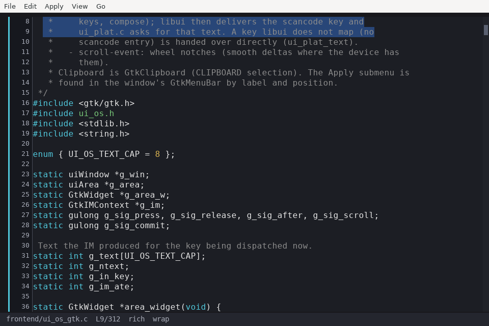
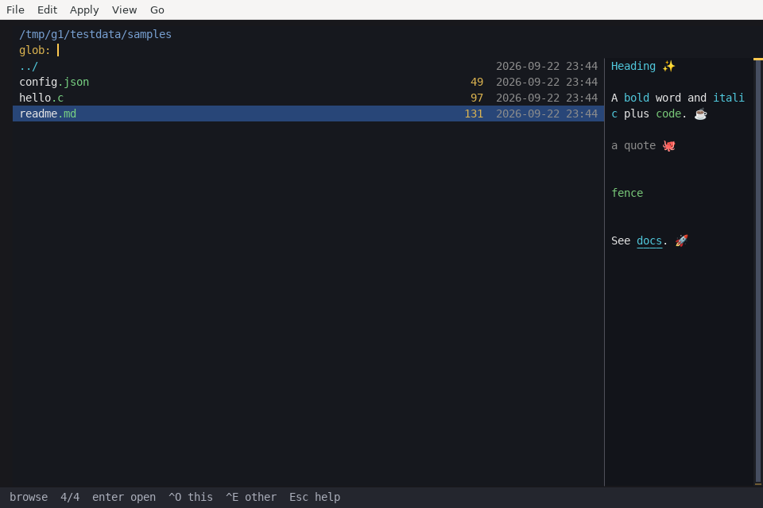
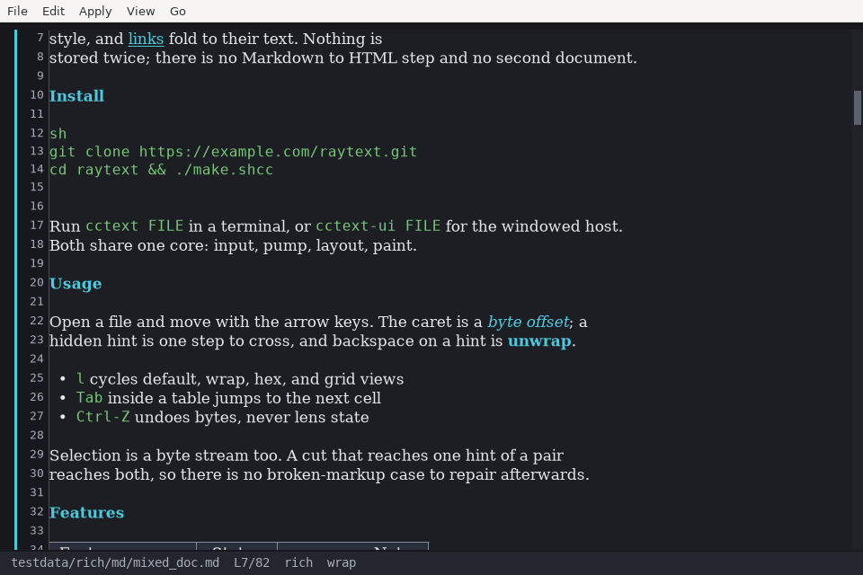

# cctext 0.1

A text editor in [Concurrent-C](https://github.com/sreekotay/concurrent-c) — a strict C11-superset preprocessor: `.ccs` lowers to plain C and compiles with your host C compile.

CCText has one document core and two frontends — **cctext** (POSIX console) and **cctext-ui** (a [libui-ng](https://github.com/libui-ng/libui-ng) window — AppKit on macOS, GTK 3 on Linux; native text).

This is a standalone app. Building from source needs `ccc` on `PATH` (or `CCC=`). Prebuilts ship on [GitHub Releases](https://github.com/sreekotay/cctext/releases) (no compiler): **cctext** and **cctext-ui** on Linux and macOS, in the same tarball. It does not live inside the compiler repository.




## Getting started

Unpack a [release](https://github.com/sreekotay/cctext/releases) (no compiler) and run it in place:

```bash
tar -xzf cctext-macos-arm64.tar.gz
./cctext-macos-arm64/cctext --version
./cctext-macos-arm64/cctext            # file browser (cwd)
./cctext-macos-arm64/cctext .          # file browser in that directory
./cctext-macos-arm64/cctext file.txt   # missing path asks to create
./cctext-macos-arm64/cctext-ui .       # same browser, libui window
```

From source: `./make.shcc @cctext` then `./bin/cctext`, `./bin/cctext .`, or `./bin/cctext file.txt`. `-h` / `--help` lists options; `-v` / `--version` prints `cctext 0.1`; `--no-blink` keeps a solid caret; `--caret=cell` (or `RTX_CARET=cell`) paints the caret into the text instead of using the terminal cursor / the GUI caret layer (for a terminal whose cursor sits wrong); `--caret-fade` eases the cctext-ui caret in and out (~100 ms); `--backup` saves in place (keeps a symlink) and writes a dirty-span `path~` first; `--stats-json` prints the Esc/= engine stats as JSON on exit; `--batch` runs `-c` commands or a stdin script with no TTY (Safe journals off unless `--safe`); `--keys FILE` / `--settings FILE` pick the key bindings and defaults files ([Keys and commands](#keys-and-commands)). Save refuses if the opened file changed on disk (mtime + size + inode); the TUI/GUI asks overwrite / cancel. `--batch` save fails with `file changed on disk`.

## Features

- **Fast on huge files.** An 8 GiB open is 0.005 ms; first-screen scroll is 0.039 ms; `g 50%` is 0.005 ms. The body stays on disk (page store). The line cache is a growing prefix plus 32 pins at 1/32 file fractions — not a full-file index. Numbers, including syntax highlight: [Perf](#perf).
- **Small.** Release `cctext` is ~1.1 MiB and `cctext-ui` ~1.3 MiB on Linux x86-64. RSS after open is 3–5 MiB at every size from 50 KiB to 2 GiB on Linux (~1.5 MiB on macOS), and an idle editor wakes zero times — no timers; the terminal blinks the caret. See [Head-to-head](#head-to-head).
- **UTF-8.** Caret, wrap, hit-test, and backspace walk UAX #29 extended grapheme clusters (ZWJ emoji, flags, combining marks). Hex stays a byte camera.
- **TUI and GUI.** Same document core: **cctext** (POSIX console) and **cctext-ui** (libui-ng window).
- **Hex / grid.** `Ctrl-L` cycles default → wrap → hex (offset | hex | UTF-8 dump) → grid (CSV/TSV/pipe columns).
- **Buffers, panes, sessions.** Open files are a buffer list shown as tabs; up to eight panes split side by side or stacked, each with its own camera (the same file in three panes scrolls three ways); the project's session comes back on the next launch. See [Buffers and panes](#buffers-and-panes). Unlock (`Ctrl-U`) lets a pane scroll off the caret.
- **File browser.** No filename opens it in the cwd. A directory argument (`cctext .`, `cctext-ui testdata`) opens browse there — not the directory as a file. `b` / `Ctrl-B` opens the listing into the focused view; `o` / `Ctrl-O` does the same. In the GUI, **File → Browse** is ⌘B / Ctrl-B (⌘O / Ctrl-O aliases it); **File → Open…** is the system dialog with no shortcut. libui menus carry no key equivalents, so chords are read by the editor area, not shown in the menu. The listing sits on the left; when the pane is wide enough the selection opens on the right as the same document core — recovered journal, camera, and view. See [Browse preview](#browse-preview). Wheel or the byte-rail scrolls the preview without opening; click the preview body to open the file. In the browser, `Ctrl-N` / `Cmd-N` launches this frontend on the selection; `e` / `Ctrl-E` launches the other (`cctext` ↔ `cctext-ui`). A new **cctext** opens in the host terminal (Cursor when you launched from there; iTerm or Terminal.app otherwise). **cctext-ui** is a window, not a terminal. The current folder (not `..`) sizes itself with a pumped walk — the total counts up, pauses if you leave, and resumes when you return. Enter still opens in this instance. A missing path asks to create an empty file.
- **Deep search.** Typing a fragment filters this directory first, then a `> Flattened search` row and nested matches append below. `>` skips the local listing and flattens immediately. A fragment is case-insensitive; `*.txt` is a real glob and stays a local listing so you can still walk directories.
- **TextMate grammars.** Drop any `.tmLanguage.json` into `grammars/` (or `RTX_GRAMMARS`) — loaded live, no rebuild. Window lex, not a full-file pass. Shipped: C/CC, JSON, Markdown, CSS, CSV/TSV/pipe, HTML, YAML, shell, Python, JS/TS.
- **Marks and folds.** `Ctrl-K/P` steps grammar marks already in the window (hint runs from the markup lens — same vocabulary as apply; not a keyword list). `Ctrl-E/R` steps `invalid`. `Ctrl-T` folds a heading or a `{}`/`[]`/`()` pair whose other end is within a page of the caret (256KiB analysis page, plus one neighbor). The matching pair is painted while the caret sits in it. No scan, no AST. Plant / cycle a mark with apply (`h` / `.` / `1–9`), not with nav.
- **TUI mouse.** SGR click, drag, and wheel; a byte-rail scrollbar jumps by file offset (not a soft line count). Hit-test is the same layout as the GUI.
- **Find.** A Ctrl-F list covers the scanned prefix: an edit shifts that prefix, and the unread tail is not reread. `Alt-C` case-insensitive, `Alt-W` whole word, `Alt-R` regex (shown in the find header). One in-tree regex engine (`core/rx.ccs`) serves find and the grammars: anchors, lookaround, backrefs, lazy / possessive / atomic, `(?i)`, UTF-8 classes, no repeat cap; a linear-time DFA / Pike VM for search and a step-budgeted backtracker only where a pattern needs it. `.` and negated classes take whole characters (an invalid byte on its own), and a match never starts inside a character. It is checked against the Rust `regex` crate's test suite (`tests/rx_conform.ccs`; the Oniguruma differences are listed there). Literal search runs at 2–5 GB/s, and so does a regex whose literal comes after an unbounded part that may cross lines (`\w+\s+Holmes\s+\w+`, `[a-z_]+\s*=\s*NULL`): the engine finds the literal first, reads back to where the match starts and confirms it forward, and falls back to a plain scan wherever that could cost more than one; a regex match may span 2 MiB block edges up to 64 KiB, and a longer one is reported, not guessed.
- **Replace.** In the find panel, `Ctrl-F` again (or `Alt-E`) opens a replace row under the find field (cctext-ui: **Edit → Replace…**, `Cmd-F` again). `Tab` / `Shift-Tab` switch fields. `Enter` in the replace field replaces the selected hit (one undo step) and selects the next one; with no hit selected the first `Enter` selects it. `Enter` in the find field goes to the next hit. `Alt-A` replaces all: one undo step for every site, over the whole file (not just the find list, which caps at 32768 hits and lists overlapping literals). A large file scans as a job with `replacing... N%` in the header; `Esc` cancels it and nothing is edited, because the sites are collected first and applied as one group. If a multi-line selection is active, `Alt-A` stays inside it; `Alt-L` switches between that and the whole file. With regex on (`Alt-R`) the replacement is a template: `$0`–`$9` (one digit), `${N}`, `${name}` for `(?<name>…)`, `$$` for `$`, `\n`, `\t`, and `\\`. Any other `$` or `\` stays as typed. Without regex the replacement is used byte for byte. Matches are leftmost and do not overlap. A zero-width match (`^`, `\b`, `x*`) is replaced once at each position, including end of file. A match longer than 64 KiB, more than 4M sites (`RTX_GROUP_MAX`), or more than 256 MiB of staged bytes is refused with a message, and nothing is edited. Rich panes replace raw bytes, so marks can change. `--batch` has `replace [--all] [--regex] [--icase] [--word] FIND REPL`, plus `undo` and `redo`.
- **Markdown.** `.md` is a markup document: a windowed, checkpointed CommonMark / GFM **block pass** (`core/md_block.ccs`) classifies fences (``` and `~~~`, any length, info string → guest grammar), indented code, ATX / setext headings, thematic breaks, quotes (lazy continuation), lists, GFM tables, front matter (YAML), `$$` math and HTML blocks; the TextMate grammar styles only the inline content (CommonMark emphasis flanking, n-backtick code, escapes, entities, links with balanced parens, images, reference links, footnotes, wikilinks, `~~strike~~`, `==highlight==`, `$math$`, autolinks). `==highlight==` paints on a highlight background (TUI and cctext-ui; in Rich the `==` are hidden like other marks). Reference links resolve through the document's definitions (`[foo]: url "title"`, matched case- and whitespace-insensitively, the first one wins): a shortcut `[foo]` or `![foo]` is a link only when `foo` is defined somewhere in the file, and Ctrl-click in Rich follows `[foo]`, `[foo][]` and `[x][foo]` to the definition's URL. The definitions are kept up to date without rescanning the file: the lex collects them in a file it lexes whole, a file up to 4 MiB is swept once by the block pass and re-swept only where an edit changed it, and a larger file knows the definitions in the parts it has lexed (an undefined `[foo]` stays text). It stays a window, not a document index: a bare window starts from the nearest safe anchor and leaves text unstyled rather than nest it wrong. Heading levels drive folds and `RtxDoc_outline`. `Ctrl-D` toggles Rich (hints at zero width, tables aligned); the bytes never change. A Rich table always fits the pane, soft wrap on or off: columns keep their natural width when they fit, else each keeps at least 25% of the room (or its natural width if shorter) and shares the rest by how much it wants; cells wrap at word breaks (a long identifier breaks where it must), a row is as tall as its tallest cell, and Up / Down, clicks and selection step through the wrapped lines. A resize or split refits. Only a table with too many columns to fit even at a few cells each keeps its horizontal scroll. The delimiter line (the `|---|` rule) shows no line number. Details: [docs/md_view.md](docs/md_view.md).
- **Markdown editing.** Source and Rich panes, one undo step per command. `Enter` in a list item starts the next one (`- ` / `* ` / `+ `, `3.` after `2.`, a fresh `- [ ] ` after a task) and inside a block quote repeats `> ` (nested and `> - item` too); `Enter` on an empty item removes the marker and ends the list, or outdents a nested item. Inserting or removing an ordered item renumbers its siblings (a lazy `1.` `1.` list keeps its number). `Shift-Enter` (`Alt-Enter` in a terminal, which cannot tell Shift-Enter from Enter) is a new line inside the item: the quote prefix and the content indent, no marker. Inside code as the block pass sees it — a fence (even one opened far above the screen), indented code, an HTML block, a `$$` math block, front matter — `Enter` is a plain newline that keeps the line's indent, `Tab` is a tab, a `- ` / `1.` line there is no list item (renumbering skips it), and auto-pairs use the code table; inside `` `code` `` or `$math$` nothing auto-pairs, and a URL pasted there stays text. `Tab` / `Shift-Tab` on a list item (caret anywhere on it, or a selection of items) nest it under the previous sibling's text column / move it back to the parent; ordered items renumber, a newly nested one starts at `1.`. `Tab` elsewhere inserts a tab, or N spaces with `--tab-spaces=N`; `Shift-Tab` takes one indent off the line. Typed openers close themselves: in Markdown `` ` `` `*` `_` `"` `[`, and `(` right after `]`; in code `(` `[` `{` `"` `'` `` ` `` (a grammar's `autoClosingPairs` or `"cctext": {"pairs": "()[]"}` replaces that table). A pair is inserted only at a word boundary (`don't`, `foo*bar`, a list `*` at the start of a line stay single); typing the closer in front of one it inserted steps over it; `Backspace` between an empty pair deletes both; an opener over a selection wraps it and keeps it selected (`*` twice makes it bold; each line of a multi-line selection is wrapped on its own). `--no-autopair` turns this off. Pasting a URL (`http(s)://`, `ftp://`, `file://`, `mailto:`) over a one-line selection makes `[selection](url)`; a multi-line paste on a quote line keeps `> ` on every line. Pair apply (`!bold` etc.) trims the whitespace around a selection, wraps each line of a multi-line selection, toggles a mark off when the selection already has it (inside or just outside the delimiters), treats a caret just after `**bold**` as outside it, and on an empty spot inserts the empty pair with the caret between (applying again removes it). In a Markdown table the apply menu (`Esc .` / `Cmd-.`, then a letter; cctext-ui also **Apply → Table**) has row above `a`, row below `b`, delete row `d`, column left `l`, column right `r`, delete column `x`, move column `<` / `>`.
- **Slides (Marp).** A `.md` whose front matter says `marp: true` is a [Marp](https://marp.app) deck: top-level `---` (or `***`, `___`) separates slides, the status bar shows `slide 3/12`, **Go to Slide** (`#N` in the jump field) lands on a slide, and `Shift-F5` (**Present Slides**) shows the slide under the caret full-window — scaled to 16:9 (or `size: 4:3`) and letterboxed in cctext-ui, in a box of cells in a terminal. Marp directives (`theme`, `paginate`, `header`, `footer`, `class: lead / invert`, `backgroundColor`, `color`, `size`, `headingDivider`, `_spot` directives, `<!-- comment -->` directives), `` backgrounds (a labelled panel: no bitmaps yet), fragmented lists (`*` / `1)`: one build step per key) and `transition` (fade, fade-out, slide, push, cover, reveal, wipe, zoom, and `morph`: lines with the same text move to their new place) are read from the bytes. Right / Space / PgDn next step, Left / PgUp back, Home / End, `N` Enter slide N, Esc back to the editor on that slide. Transitions run at the display refresh only while they play; a still slide wakes nothing. See [Slides](#slides-marp) and [docs/slides.md](docs/slides.md).
- **Workbooks (W0, W2).** A `*.wb.md` file is a workbook: `Table: Name` over a GFM table names it, its header names the columns, and a cell starting with `=` (or `` `=…` ``) is a formula over names — `sum(Sales.amount where region = @region)`, `@actual - @target`, `Targets[region = "EU"].actual` — never A1 cells. `params` / `calc` fences hold named values per sheet (H1). Rich panes paint each formula's value in its place; while the caret is in a formula its live value follows it, dimmed (` → 1234.50`, Rich and Source, both frontends), updated on every keystroke — a half-typed formula shows its error — and never written. The status bar shows the value or the error (`#div0(division by zero in Targets.gap[2])`, `#cycle(a → b → a)`) at the caret. An edit recalcs only its dependents, in dependency order, stopping where a value did not change. Aggregates are **maintained** (W2): exact partials kept current by row deltas, so one cell edit under 1000 aggregates of its column takes ~0.7 ms where W0 rescanned for ~100 ms; float sums are exact (the true sum rounded once, whatever the order), `dec` sums exact integers; inserting or deleting table rows is a delta too, not a reparse. Embedded tables go to a million rows (about 3.5 KB of memory a row; at 1 M rows a cell edit under 1000 aggregates still takes under half a millisecond), and in a workbook over 1 MiB a structural edit (a header, a fence) reparses when typing pauses rather than on the keystroke ([W2 at scale](docs/workbook.md#w2-at-scale)). `by = group Sales by region { n: count(), total: sum(amount) }` names a grouped table (`by[region = "EU"].total`). `F2` renames a table, column or name everywhere as one undo step. Values are never written into the file. See [docs/workbook.md](docs/workbook.md#w2-as-built).
- **Edit groups.** One command is one undo step: table ops, apply, multi-site edits and replace-all record a group; a group that spans files is a workspace transaction (undo asks: all / this file / cancel). Groups of 1024+ sites take a bulk path — one piece-sequence swap and a compact undo record — so a 1.3 M-site replace-all on 100 MiB applies in ~0.4 s at ~33 MiB peak RSS, and undo / redo are a swap.
- **Terminal.** Bracketed paste is one insert (CRLF normalised, tabs literal); PgUp / PgDn, Ctrl-Home / End, Shift-Insert / Ctrl-Insert; the caret is the terminal's own cursor; Ctrl-Z suspends; a crash or signal restores the tty; copy falls back to OSC 52 (tmux / SSH); names, paths and bytes written to the terminal are sanitised (no escape injection from file names). A frame writes only the rows that changed, in one write inside a synchronized update (DEC 2026); a scroll of a full-width pane moves its rows with a scroll region (DECSTBM + delete / insert line) and writes only the rows that came into view plus the ones whose gutter, rail or caret changed — about 0.3-0.5 KB per wheel notch on a 200x50 screen instead of the whole frame. Side-by-side panes share their rows, so they keep whole-row rewrites. `--no-scroll-regions`, `"scroll_regions": false` or `RTX_SCROLL_REGIONS=0` turns region scrolls off (they are off for `TERM=dumb`); exit, ^Z and a crash reset the region.
- **Byte jump.** A pane is **seeking** (byte camera) or **lined** (after `line_of`). `g 50%` snaps to the mid-file line with a local read (8 KiB). A planted pin at that 1/32 slot re-keys the gutter; otherwise it shows `+1`… / `-L` until the prefix meets the camera. Arrows and wheel stay on that camera — they do not `line_of` the prefix. Absolute `g L` pumps the prefix and shows `scanning... N%` on the jump field.
- **High-performance scroll.** Only the visible window is measured and highlighted. Idle frames skip relayout.
- **Save conflict.** Save stamps mtime + size + inode at open and after a successful write. If that path changed on disk, Save asks overwrite / cancel (TUI and GUI). `--batch` `save` fails with `file changed on disk`. Overwrite is a whole-file write, not a `--backup` dirty span. A missing dest is recreated.
- **Quick-open and project search.** `Ctrl-P` fuzzy-finds any file of the project (repository root, `.gitignore` honored) as a background walk indexes it; `Ctrl-Shift-F` (`Alt-Shift-F` in most terminals) searches every file with the find engine and its options, results grouped by file, `F4` / `Shift-F4` to step them. See [Quick-open and project search](#quick-open-and-project-search).
- **Command palette and keymap.** `Ctrl-Shift-P` / `F1` / `Esc :` (cctext-ui: `Cmd-Shift-P` / `Ctrl-Shift-P`) lists every command with its keys, fuzzy-filtered, recently used first. One command table drives the keys, the help overlay, the cctext-ui menus and the palette; `~/.config/cctext/keys.json` rebinds or unbinds any chord and `settings.json` holds the defaults the flags override. See [Keys and commands](#keys-and-commands).
- **Safe journals.** Crash / recover state for named files. Reopen can show **recovered edits** (session hist replayed onto the file on disk) — not a silent write of your path. See [Safe journals](#safe-journals).

## Frontends

| | **cctext** | **cctext-ui** |
|---|---|---|
| Surface | POSIX terminal (termios + ANSI, SGR mouse) | libui-ng window; paint runs in the area Draw callback |
| macOS | yes | AppKit window, Core Text text |
| Linux | yes | GTK 3 window, Pango / cairo text |
| Windows | — | not yet (`frontend/ui_os_win32.c` is a stub listing the Win32 pieces) |

Both hosts run the same paint / input TUIs over the same core. cctext-ui is portable libui code (`frontend/ui_plat.c`) plus one small shim per toolkit behind `frontend/ui_os.h` (`ui_os_darwin.m`, `ui_os_gtk.c`) for what libui does not expose: typed text, the wheel, the clipboard, retitling the Apply menu, and an event step with a deadline. Fonts: Menlo / Georgia on macOS; the fontconfig `Monospace` / `Serif` aliases on Linux.





Memory on Linux (Xvfb, 3 MiB `large.txt`, after open): cctext-ui ≈ 83 MiB RSS — ≈ 68 MiB of it file-backed GTK / Pango / fontconfig pages shared with other GTK apps, ≈ 15 MiB anonymous; an empty libui window is ≈ 76 MiB on the same host. cctext is 3.5 MiB.

Known cctext-ui gaps: libui menus carry no key equivalents (chords are read by the editor area and not shown in the menus; the palette and the help overlay show them); on GTK typed text goes through `GtkIMContextSimple` (layout, dead keys, compose — no ibus / fcitx preedit); each measure and draw builds a libui text layout per run (no glyph cache).

## Keys and commands

Every command is one row of the command table (`core/cmd.cch` / `cmd.ccs`): a stable id (`file.save`, `view.cycle`, `find.replace_all`, `md.table.delete_column`), a title, a category, default chords for each frontend, its `Esc` letter, and when it is enabled (in a table, find open, a markup document, …). Key dispatch in both frontends, the help overlay (`Esc`, generated from the table and the live keymap), the cctext-ui menus and the command palette all read that table.

**Palette.** `Ctrl-Shift-P` or `F1` in both frontends (cctext-ui on macOS: `Cmd-Shift-P`); in a terminal that cannot send Ctrl-Shift-P (it arrives as Ctrl-P unless the terminal speaks kitty's CSI u or xterm's modifyOtherKeys), use `F1` or `Esc` then `:`. Type to filter (fuzzy: word starts, camel humps and runs score higher), `Up` / `Down` (or `Ctrl-P` / `Ctrl-N`) to pick, `Enter` to run, `Esc` to close. An empty query lists recently run commands first. Commands that do not apply here (table commands outside a table, find toggles with find closed) are not listed; ids reserved for commands that are not built yet show as `(unavailable)`.

**Default keys.** `Ctrl` is `Cmd` in cctext-ui on macOS (either works). The letter column is the `Esc`-overlay letter (also `Alt`-letter in a terminal).

| Command | id | cctext | cctext-ui | letter |
|---|---|---|---|---|
| Command Palette | `palette.open` | Ctrl-Shift-P, F1 | Ctrl-Shift-P, F1 | `:` |
| Go to Line | `go.line` | Ctrl-G | Ctrl-G, Ctrl-J | `g` |
| Go to Slide | `go.slide` | palette, `#N` in Go to Line | Go menu, palette, `#N` in Go to Line | |
| Find | `find.open` | Ctrl-F | Ctrl-F | `f` |
| Replace | `find.replace` | Ctrl-F in find | Edit → Replace, Ctrl-F in find | |
| Find: ignore case / whole word / regex | `find.toggle_case` / `_word` / `_regex` | Alt-C / W / R in find | same | |
| Find: replace row / all / scope | `find.toggle_replace` / `find.replace_all` / `find.toggle_scope` | Alt-E / A / L in find | same | |
| Quick Open | `workspace.quick_open` | Ctrl-P | Ctrl-P | |
| Search in Project | `workspace.search` | Ctrl-Shift-F, Alt-Shift-F | Ctrl-Shift-F | |
| Next / Previous Search Result | `workspace.search_next` / `workspace.search_prev` | F4 / Shift-F4 | F4 / Shift-F4 | |
| Re-index Project | `workspace.reindex` | F5 | F5 | |
| Next / Previous Mark | `nav.next_mark` / `nav.prev_mark` | Ctrl-K / Alt-P | Ctrl-K | `k` / `p` |
| Next / Previous Invalid | `nav.next_invalid` / `nav.prev_invalid` | Ctrl-E / Ctrl-R | Ctrl-E / Ctrl-R | `e` / `r` |
| Fold / Unfold | `nav.fold` | Ctrl-T | Ctrl-T | `t` |
| Apply Menu | `apply.menu` | Ctrl-. | Ctrl-. | `.` |
| Cycle Prefix | `apply.cycle` | | Ctrl-Shift-H | `h` |
| Apply 1-9 | `apply.named` | `Esc` / apply menu, then 1-9 | Ctrl-1 … Ctrl-9 | |
| Table: insert row above / below, delete row, insert column left / right, delete column, move column left / right | `md.table.insert_row_above`, `…_below`, `md.table.delete_row`, `md.table.insert_column_left`, `…_right`, `md.table.delete_column`, `md.table.move_column_left`, `…_right` | palette; apply menu `a b d l r x < >` | palette; Apply menu | |
| Workbook: Rename (table / column / name at the caret, everywhere) | `workbook.rename` | F2 | F2, Edit menu | |
| Workbook: Recalculate | `workbook.recalc` | palette | palette | |
| Open File | `file.open` | | File → Open… | |
| Browse Files | `file.browse` | Ctrl-B, Ctrl-O | Ctrl-B, Ctrl-O | `b` `o` |
| Save | `file.save` | Ctrl-S | Ctrl-S | `s` |
| Undo / Redo | `edit.undo` / `edit.redo` | Ctrl-Z / Ctrl-Y | Ctrl-Z / Ctrl-Y, Ctrl-Shift-Z | `z` / `y` |
| Cut / Copy / Paste / Select All | `edit.cut` / `edit.copy` / `edit.paste` / `edit.select_all` | Ctrl-X / C / V / A | same | `x` `c` `v` `a` |
| Next / Previous Buffer | `buffer.next` / `buffer.prev` | Ctrl-PgDn / Ctrl-PgUp, Ctrl-Tab / Ctrl-Shift-Tab | same | |
| Next File | `file.next` | Ctrl-N | Ctrl-N | `n` |
| Close Buffer | `buffer.close` | Alt-W | Ctrl-W (Cmd-W) | |
| Close Other Buffers / All Buffers | `buffer.close_others` / `buffer.close_all` | palette | File menu, palette | |
| Next / Previous Pane | `pane.focus_next` / `pane.focus_prev` | Ctrl-W, F6 / Shift-F6 | F6 / Shift-F6 | `w` |
| Split Right / Down | `pane.split_right` / `pane.split_down` | Ctrl-\\ / Ctrl-- (Ctrl-_) | Ctrl-\\ / Ctrl-Shift-\\, Ctrl-- | `\` / `-` |
| Close Pane | `pane.close` | Ctrl-] | Ctrl-Shift-W | `0` |
| Move Buffer to Next Pane | `pane.move_buffer` | Ctrl-F6 | Ctrl-F6 | |
| Move Divider Left / Right / Up / Down | `pane.resize_left` / `_right` / `_up` / `_down` | Ctrl-Alt-arrows | Ctrl-Alt-arrows | |
| Tab Bar On / Off | `view.tabs` | palette | View menu, palette | |
| Cycle View | `view.cycle` | Ctrl-L | Ctrl-L | `l` |
| Wrap On / Off | `view.wrap` | Alt-M | Ctrl-Shift-M | `m` |
| Rich / Source | `view.rich` | Ctrl-D | Ctrl-D | `d` |
| Follow Caret | `view.follow` | Ctrl-U | Ctrl-U | `u` |
| Present Slides | `slides.present` | Shift-F5 | Shift-F5, View menu | |
| Key Bindings | `view.help` | Esc | Esc, Ctrl-/ | |
| Engine Stats | `view.stats` | Ctrl-= | Ctrl-= | `=` |
| Quit | `app.quit` | Ctrl-Q | Ctrl-Q | `q` |

No id is reserved now: `workspace.quick_open` and `workspace.search` have landed, so Ctrl-P is Quick Open (Previous Mark keeps Alt-P / `Esc p`) and Ctrl-Shift-F is Search in Project (Alt-Shift-F in a terminal that sends Ctrl-F for it). A row a later change registers with a reserved id still replaces the reservation. The terminal keeps Ctrl-W = Next Pane and closes a buffer with Alt-W; `"tui": { "ctrl+w": "buffer.close" }` in keys.json makes it Ctrl-W. The older ids `pane.other` (Next Pane) and `pane.split` (Split Right) still resolve. A `Ctrl-Shift-letter` nothing binds runs `Ctrl-letter` (as before the table); named keys do not fall back.

**keys.json.** `$RTX_KEYS`, or `--keys FILE`, else `$XDG_CONFIG_HOME/cctext/keys.json`, else `~/.config/cctext/keys.json` — the same path on macOS, for both frontends. A missing default file is fine; a missing `--keys` file, a JSON error, an unknown key name or an unknown command id is reported on the status bar at start and never stops the editor (a JSON error keeps every default).

```jsonc
{
  "ctrl+shift+p": "palette.open",          // bind
  "ctrl+p": ["workspace.quick_open", "nav.prev_mark"],  // chain: first that exists runs
  "ctrl+t": null,                          // unbind ("" and "-" too)
  "f5": "file.save",
  "tui": { "alt+s": "file.save" },         // cctext only
  "gui": { "ctrl+d": "view.wrap" }         // cctext-ui only
}
```

A chord is modifiers and a key joined by `+` or `-`: `ctrl` (also `cmd`, `super`, `mod` — one command modifier), `shift`, `alt` (`opt`); keys are a letter or punctuation, `f1`-`f12`, `tab`, `enter`, `esc`, `space`, `pgup`, `pgdn`, `home`, `end`, `up` / `down` / `left` / `right`, `insert`, `delete`, `backspace`. A later entry for the same chord wins. `//` and `/* */` comments are allowed. The find field's `Alt` toggles and the apply menu's letters belong to those modes and are not remapped. A terminal reports what it can: Ctrl-Shift-letter, Ctrl-Tab and Ctrl-punctuation only through kitty's CSI u or xterm's modifyOtherKeys; Ctrl-H / I / J / M are Backspace / Tab / Enter.

**settings.json** sits beside keys.json (`$RTX_SETTINGS` or `--settings FILE` override). Its values are defaults; command-line flags still win.

```json
{ "tab_spaces": 4, "autopair": true, "blink": true, "caret": "cursor", "caret_fade": false, "rich": true, "esc_timeout_ms": 10, "scroll_regions": true, "search_index": true, "search_index_pct": 2 }
```

`tab_spaces` is `--tab-spaces` (0 = a tab), `autopair` is the inverse of `--no-autopair`, `blink` of `--no-blink`, `caret` is `--caret=cursor|cell`, `caret_fade` is `--caret-fade`, and `rich: false` opens markup files in Source unless a journal says Rich. `esc_timeout_ms` (1-1000, default 10; `RTX_ESC_MS` overrides) is how long the terminal build waits after a lone Esc for the rest of an escape sequence before it acts on the key; a sequence already under way (`ESC [` …) still gets 40 ms, and a mouse or focus report that arrives late is still read as one. Raise it on a link that splits sequences right after the ESC byte. `scroll_regions: false` is `--no-scroll-regions` (see **Terminal** above).

**Adding a command.** Add a row to `g_cmd_rows` in `core/cmd.ccs` with a new `CMD_*` (`core/ui_cmd.cch`) and handle that id in each host's dispatch (`cctext_kind_of_row` / `cctext_run_cmd` in `frontend/cctext_input.ccs`, `gui_run_cmd` in `frontend/gui_input.ccs`) — or give the row a `run` hook (`RtxCmdCtx` carries the workspace, the UI state and the focused buffer) and register it with `rtx_cmd_register` before the keymap loads; no host change. A row with a reserved id replaces the reservation, and its `^` chords take over.

## Buffers and panes

**Buffers.** Every open file is a buffer; the list is in the order they were opened and shows as a **tab bar** — one row at the top of the terminal, a strip in cctext-ui. The focused pane's buffer is lit, a buffer another pane shows is brighter, `●` marks unsaved edits and `×` closes. Click a tab to show it in the focused pane; middle-click it, or click its `×` / `●`, to close it. When the tabs do not fit, the lit one stays in view and `‹` / `›` (clickable) mark the rest. By default the bar appears with two or more buffers: `--tabs=always|never|auto` (or `RTX_TABS`, `--no-tabs`) sets that, and **Tab Bar On / Off** (`view.tabs`) toggles it. `Ctrl-PgDn` / `Ctrl-PgUp` (and `Ctrl-Tab` / `Ctrl-Shift-Tab` where the terminal sends them) step through the tabs.

**Close.** **Close Buffer** (`Cmd-W` / `Ctrl-W` in cctext-ui, `Alt-W` in a terminal) closes the focused pane's buffer. Unsaved, it asks **Save / Don't save / Cancel** (the quit prompt; a native dialog in cctext-ui); Don't save drops its Safe journal the way quit-`q` does, and a Save that cannot happen (untitled, changed on disk) closes nothing and says why. Every pane that showed it moves to the nearest tab no other pane shows. Closing the last buffer leaves an untitled one — it never quits (`Ctrl-Q` does). **Close Other Buffers** / **Close All Buffers** ask once for all the unsaved ones.

**Panes.** Up to eight panes, split right (`Ctrl-\`) or down (`Ctrl--`; a terminal sends it for `Ctrl-_` / `Ctrl-/` too; `Ctrl-Shift-\` in cctext-ui), nested any way. A new pane shows the same buffer on its own camera. `F6` / `Shift-F6` (and `Ctrl-W` in a terminal) move the focus in tree order, a click focuses the pane under it, the wheel scrolls the pane under the pointer without moving focus. `Ctrl-]` (`Ctrl-Shift-W` in cctext-ui) closes the focused pane and its neighbour takes the space. Drag a divider — the `│` / `─` in a terminal, the gap in cctext-ui — or press `Ctrl-Alt-arrows` to move the nearest divider. `Ctrl-F6` moves the focused buffer into the next pane. Each pane has its own browse and preview (`Ctrl-B` browses in the focused pane only). The same file in several panes is several cameras on one document: an edit reparses once and every camera patches or refills its rows.

**Sessions.** The workspace snapshot is per project: the project is the nearest directory at or above the current one that holds `.git`, else the current directory. It keeps the buffer list, the pane tree (splits, ratios, which file each pane shows) and the focus, and `cctext` / `cctext-ui` with no arguments in that project restores it. Another project has its own. A snapshot from before projects (one global file) loads once, into the first project launched without one, and is then gone.

## Quick-open and project search

The **project** is the repository root above the file you opened (the first directory with a `.git` in or above it, a worktree's `.git` file too), else the directory you started in (with no file argument, the session's project: the same root the workspace snapshot uses); `--project DIR` names it for both. Nothing is read until the first `Ctrl-P` / `Ctrl-Shift-F`; from then on a background walk lists every file under the root and both pickers use it while it grows (the header says `indexing...`).

**Index.** The walk honors `.gitignore` at every level (nested files, `!` negation, `/`-anchored and `dir/` patterns, `*` `?` `[...]` `**`, `\#` / `\!` escapes, trailing spaces), ripgrep's `.ignore`, and `.git/info/exclude`; it skips `.git`, does not cross into another filesystem, lists symlinked files and does not follow symlinked directories (the index code can, loop-safe, by device and inode). Hidden files are listed. Paths are interned (a directory's path once, each file a name plus its directory): about 15-30 bytes per file, so a million files is tens of MiB. There is no file watcher yet: `F5` (`workspace.reindex`) walks again in the background and swaps the new index in when it is done; the old one stays usable meanwhile.

**Quick-open** — `Ctrl-P` (cctext-ui: `Cmd-P`, `File → Quick Open`). Type any part of a path: characters match in order (`wsc` finds `core/workspace.ccs`). Matches that start a path segment, a word (`_` `-` `.` space) or a camel hump, runs of adjacent characters and matches in the file name score higher; gaps cost. Lowercase matches either case; an uppercase letter only itself. Files you opened recently (per project, kept in the Safe cache directory) rise to the top, and an empty query lists them first. The list keeps the best 512 however large the index, updates as you type and as the walk finds more files, and highlights the matched characters. `Enter` opens the file in the focused pane; `Alt-Enter` / `Ctrl-Enter` (cctext-ui: `Cmd-Enter`) in the other pane, splitting if there is one pane. `Ctrl-P` again moves down; `Tab` switches to project search with its own query.

**Project search** — `Ctrl-Shift-F` (cctext-ui: `Cmd-Shift-F`, `File → Search in Project`). Most terminals send `Ctrl-Shift-F` as plain `Ctrl-F` (find): use `Alt-Shift-F` there, or a terminal with kitty's CSI u / xterm's modifyOtherKeys. A one-line selection pre-fills the query. The search starts 120 ms after you stop typing (`Enter` starts it at once) and uses the find engine and its options: `Alt-C` ignore case, `Alt-W` whole word, `Alt-R` regex. Every indexed file is read whole and searched in parallel; binaries (a NUL byte in the first 8 KiB) and files over 8 MiB are skipped and counted. Results stream in, grouped by file with a count, each row the line number and the line with the match highlighted; the header shows matches, files and progress, and `Esc` hides the panel without stopping or losing anything. `Enter` on a result opens the file with the match selected and its line at the top (`Alt-Enter`: other pane); on a file row, its first match. The results stay after you close the panel or switch files: `F4` / `Shift-F4` open the next / previous match, and `Ctrl-Shift-F` shows the list again. Offsets are the file on disk: in a buffer with unsaved edits a result can land off by the edit.

**Search index** — **Build Search Index** in the command palette builds, in the background, a small index of the project: one Bloom filter of trigrams per 64 KiB block of files, or per 64 KiB chunk of a bigger file (`search_index_pct` of the indexed bytes, default 2 %; the header shows `indexing N%`, the status line the result). **Update Search Index** re-reads only the blocks whose files changed and adds new files at the end — on Linux half a second instead of five — and falls back to a full build when more than a fifth of the blocks changed. A later search — in this session or the next — uses it when the query has required literals of 3+ bytes (a literal, an ignore-case one, or a regex's required literal / alternation branches): files none of whose blocks can hold one are skipped unopened (`index skipped N` in the header), and a big file is read only around the chunks that can, when the pattern cannot match across a line break (line numbers stay exact). Otherwise, and whenever there is no index, the search is the plain scan. Results never change: a file is read whenever its size, inode, mtime or ctime (nanoseconds) differ from the build, when it changed within 100 ms (2 s on a file system without sub-second stamps) of the build, when it is new, when another path shares its inode, or when it has unsaved edits in a buffer. The index lives in the Safe cache directory beside the project's workspace snapshot (`w/<hash>.si`, checksummed; a bad or old file is ignored), never in the project. On Linux at 2 % a search for an identifier reads 1–15 % of the bytes (median of ripgrep's benchsuite and a dozen identifiers: 12 %) — DESIGN.md (Search index) has the numbers. `"search_index": false` in settings.json or `RTX_SEARCH_INDEX=0` turns it off.

**Batch.** `cctext --batch --project DIR -c 'project-files [QUERY]'` prints every indexed path sorted, or the quick-open ranking for `QUERY`; `--stats` adds counts, walk time, store bytes and per-keystroke scoring times; `--rewalk`, `--follow` (walk symlinked dirs) and `--no-ignore` change the walk. `project-search [--regex] [--icase] [--word] [--max-size BYTES] [--stats] QUERY` prints `path:line:col: line` per match and a `# N matches in F files ...` summary with the bytes searched, the time and the files the search index skipped or read by chunks; `--stats` adds the walk / stat / read / scan split and what the index did. `project-index [--pct N] [--update] [--lanes N]` builds the search index (or updates it: only changed blocks) and reports its size and cost; the index is used and built only with `--safe` (it lives in the Safe dir). `bench/rg_suite.py` runs ripgrep's benchsuite Linux queries (and the index simulation's identifiers) against rg and cctext with and without the index, with bytes and files read, the time split, and `--build` / `--update` costs. Without `--project` the root is the repository above the file argument, else the working directory.

## Slides (Marp)

A Markdown file is a slide deck when its front matter says `marp: true`:

```markdown
---
marp: true
theme: default          # default / gaia / uncover
paginate: true
footer: My talk
transition: fade        # Marp CLI names; `morph` moves matching lines
---

# Title slide

---

<!-- _class: invert -->
## Build steps

* appears first
* then this
```

A `*` or `1)` list is a fragmented list: its items are build steps.

Editing is the Markdown editor you already have (Source or Rich); the block pass reads a top-level thematic break as a slide separator (a `---` directly under a paragraph is a setext heading, as in Marp: leave a blank line). The status bar shows `slide N/M`; **Go to Slide** (palette / Go menu, or `#N` in `Ctrl-G`) jumps; `cctext --batch deck.md -c slides` prints the outline (number, line, steps, transition, title).

`Shift-F5` (**Present Slides**, View menu, palette) presents from the slide under the caret. Keys: Right / Down / PgDn / Space / Enter next step, Left / Up / PgUp / Backspace back, Home / End first / last, digits then Enter go to that slide, Esc (or `q`, or `Shift-F5`) back to the editor with the caret on the slide shown. A click or the wheel steps too. cctext-ui draws headings larger, code with its grammar's colours, tables, quotes, header / footer / page numbers, and animates the transitions (~300 ms, eased, at the frame clock); images are labelled frames. The terminal draws the slide in a box of cells; its transitions are a column move (slide / push / cover / reveal) or a wipe. Scope, model and limits: [docs/slides.md](docs/slides.md). Sample: `testdata/slides/demo.md`.

## Why

- **Piece tree** over a page store (path original + spilled add) plus borrowed buffers. Offset and line lookup are O(log pieces).
- **Sections** set layout policy (code vs prose). **Runs** inside a section are rich text and syntax tokens.
- **Syntax highlight** is a core pass over code sections. Runs carry interned scopes; frontends theme a prefix. Spike lexer, or a lowered TextMate table when the path’s extension is in a grammar loaded at runtime (`RTX_GRAMMARS`, else `<exe>/grammars`, else `<exe>/../testdata/grammars`). Open `testdata/samples/` to try them.
- Measure-generic layout so wrap and hit-test are the same algorithm in pixels (GUI) and cells (`cctext`). View cycles with `Ctrl-L`: default → wrap → hex (offset|hex|UTF-8 dump) → grid → default. The browser preview is that same fill, not a second renderer.
- Headless tests do not open a window.

## Browse preview

The right-hand pane opens the selected file the same way an editor pane does (`from_path` plus that file’s Safe journal) and never flushes. Recovered edits, caret, selection, and camera come back — wrap row, horizontal column, hex nibble, view, unlock, pin — not byte 0 of a fresh buffer. Journal pins (1/32 file fractions) come with the camera, so a mid-file view does not wait on a full line index. A file left in grid at column 147 is still there when you pass it in the listing.

`Ctrl-L` cycles default → wrap → hex → grid on the preview only. That does not write the journal. Wheel or the byte-rail scrolls the preview without opening; click the preview body to take it as a live pane. Listing moves kick a dest-live open into a staging doc (same schedule as find / browse listing); the UI thread only adopts and fills when the arm finishes, so key-repeat never blocks on `from_path`.

Browse away from an open file still [parks](#safe-journals): flush, then evict. The preview is the load side of that session, without the write.

## Status

Piece tree over a page store, windowed TextMate highlight on one in-tree regex engine, incremental relayout, save / conflict / Safe journals, undo / redo with edit groups and bulk replace, find / replace with regex, Markdown block pass + Rich lens + editing, hex / grid, a file browser with async preview, and multifile splits. **cctext** (TUI) and **cctext-ui** (libui-ng: macOS and Linux; Windows is a stub) share that core. Design notes: [DESIGN.md](DESIGN.md), [docs/md_view.md](docs/md_view.md), [docs/slides.md](docs/slides.md), [docs/mark_arity.md](docs/mark_arity.md), [docs/grammar_audit.md](docs/grammar_audit.md). Workbooks: [docs/workbook.md](docs/workbook.md) (W0 names and W2 maintained aggregates built; external tables and views planned).

## Safe journals

Two different writes. Save is the file. The session is a cache journal — crash / recover state, not a silent write of your path.

| | Where | When |
|---|---|---|
| **Save** (`Ctrl/Cmd-S`) | Your file (temp + rename) | Only when you ask; refuses if that path changed on disk |
| **Safe journal** | Cache dir (not your path) | Automatic for **named** buffers |

Journals live under `~/Library/Caches/cctext/safe` on macOS, or `$XDG_CACHE_HOME/cctext/safe` elsewhere. `RTX_SAFE_HOME` overrides. A file journal is keyed by a hash of the **real path** (not the basename). Writes use the same temp + rename as Save. An idle journal fault does not fail the edit. Park of a **dirty** buffer requires a successful hist journal — if that write fails, the document stays live (switching away must not drop the newest unsaved delta). The leaf is that hash — **not a silent write of your path**.

**Untitled has no journal** and cannot park.

### What is stored

A **file journal** is the named buffer’s session:

- Flattened undo/redo (inserts and deletes as bytes, including piece-ref deletes), with edit groups (one command, one undo step) marked by an END flag on their last record. Dirty is `hist.head != saved_head`.
- Caret, stream selection, and box columns.
- Camera: line or byte (`top` / `seek_off`), wrap row, `left_col`, hex nibble, view, unlock, pin.
- A live gutter origin (`mark_line` + `seek_rel`) plus up to 32 line→byte pins at 1/32 file fractions (vacant until known). Pins re-key the origin on land / reopen; they are not a paint-time gate. An edit drops the origin and every pin at or after that byte.
- Identity of the file hist is relative to: the stamp taken at open / last Save (nanosecond mtime + size + inode), not a stat of the path at flush time. While dirty, a copy of that base (`.b`) so a drifted file does not strand the edits.

A **workspace snapshot** is the project's last session (`w/<hash of the project root>` under the Safe directory): open paths, dirty bits, view per file, the pane tree (splits, ratios, focus, and which file each pane shows — by entry in that path list, so an untitled buffer or a file that is gone at restore does not shift a pane onto another file) and each pane's browse divider. It is not the document bytes.

Not stored: find, clipboard, folds, highlight runs, the full line-index prefix.

### When it writes

Both frontends call `safe_pump` every frame:

1. **~250 ms after the last session change** — last-change debounce. Hist (`edit_gen` / `saved_head`) writes the `RTXS` leaf (undo recs). Caret / selection / camera / pins write only the `RTXC` sidecar (`<hash>.s`). A jump or a drag with no type still writes state once you pause. Scrolling does not rewrite hist. A failed hist write does not mark the journal current and does not allow a later park to evict. The idle retry backs off: 250 ms after the miss, doubling to 8 s (`RTX_SAFE_BACKOFF_MAX_MS`); a new edit does not jump the wait. Browse-away, quit, and Save still try at once.
2. **Browse away** — flush the journal, then **park** (evict the document from RAM) only if that hist write landed or the buffer is clean. A dirty flush miss keeps the document live and shows the fault. Live set is the pane slots. Returning unparks and reloads from path + journal. Browse does not ask and does not write your path. The [listing preview](#browse-preview) is that same load and does not flush.
3. **Unsaved-quit prompt** — flush everything first so a crash mid-dialog is recoverable.
4. **After a real Save** — journal refreshed to match clean hist.
5. **Workspace snapshot** — updated on park sync, flush-all, save-dirty, and discard.

### Recovered edits

**Recovered edits** means the journal replayed: undo/redo from the saved head to the journaled head, then caret/selection (offsets past EOF clamp). The buffer can look dirty. That is the last session, not a new Save. **Not a silent write of your path.**

Launch with **no files** and the project's last workspace comes back: parked paths stay on disk until a pane shows them, then they unpark. A parked file that was moved or deleted does not come back as an empty pane: it stays parked with its journal untouched, the status bar names it, and its pane shows the next buffer that can open (a dirty one with a pinned base comes back from the pin, and Save recreates the file). Two spellings of one file on the command line (`a.txt ./a.txt`) open one buffer. Launch with a path and that file’s journal is applied after `from_path`.

On load, a **clean** journal (no unsaved edits, only undo history) whose identity no longer matches the file on disk **tosses hist** (camera may still apply). You see the file as it is; it is not dirty.

A **dirty** journal is never tossed because the file changed. Hist is relative to the bytes the edits were made against, so every dirty flush also **pins that base**: a copy of the file as it was at open / last Save, `<hash>.b` beside the journal, stamped with the base's size and nanosecond mtime (copied only while the path still carries that exact identity, up to `RTX_SAFE_BASE_MAX` = 16 MiB; dropped when the journal goes clean or is discarded). When the file drifts — edited elsewhere while the buffer was parked, replaced, or deleted — reopen / unpark / Save-all opens the pin instead, named as your path, and replays there: the buffer comes back **dirty, with undo**, exactly as you left it, and the status bar says the file changed on disk. Its disk stamp is the old base, so Save asks overwrite / cancel; nothing writes your path until you choose. Quit → Save counts parked dirty buffers too (`any_disk_changed`), so it stops at that prompt instead of reporting success.

With **no pin** (the path had already drifted before the first dirty flush, the base is over the cap, or the copy failed) the edits cannot be replayed onto anything honest. The journal is **held**: the buffer shows the file on disk, the journal stays on disk untouched (no journal writes for that buffer until you decide), the status bar says `changed on disk: unsaved edits held in Safe journal`, the buffer counts as unsaved (quit asks), and Save-all refuses rather than report success. Quit `q` drops it.

A corrupt journal, or one whose version is below `RTX_SAFE_FILE_VER_MIN` or newer than this build (`RTX_SAFE_FILE_VER`), is ignored the same way. Corrupt means: the FNV-1a 64 trailer does not match, a length field (record count, delete / insert bytes) does not fit in the bytes that remain, or the stored real path is not this file's (a hash neighbour, or a hard link sharing the inode). Lengths are checked before they size an allocation, and nothing replays until the whole leaf checks out. Identity mtime is nanoseconds (`st_mtim` / `st_mtimespec`), for journals and for Save's conflict check, so a same-size rewrite inside one second still drifts. File journals are `RTXS` + a little-endian version (now 8: a bulk group is one compact record — gaps, delete / insert lengths and the inserted bytes once — rebuilt into piece sequences on first undo; v7 added a per-record edit-group id, workspace transaction id and group END flag; v6 added nanosecond identity + trailer sum; v1–7 still load, v1–5 with whole-second identity and no sum). A group replays whole or not at all: an unterminated trailing group is dropped and the head falls back to its edge. Camera / caret live in a sibling `RTXC` sidecar so a pause after scroll does not rewrite hist; the base pin is the `.b` sibling. A file journal keeps one camera: the one on the buffer, which is the focused pane's while it shows that file (another pane's camera on the same file lives for the session only). Workspace snapshots are `RTXW` v4 (per project, root path in the header, preorder pane tree, FNV-1a trailer, exact version); the old global `ws` leaf (v1–3) is read once for migration.

A journal that checks out but fails to replay midway (an undo record the file cannot take) is **held**: the buffer reopens as the file on disk — never the half-applied bytes — the journal stays on disk untouched (no journal writes for that buffer), the status bar says so, the buffer counts as unsaved, and Save-all on quit refuses rather than report success. Quit `q` drops it.

Quit with **Don't save** / `q` **drops** dirty journals so the next open is the file on disk. The TUI does not flush again after that drop. A later “suspend quit” is not this cut.

## Setup

Recipes live in `make.shcc` (`ccc --as=shcc`). There is no Makefile.

```bash
./setup.sh                  # checks ccc; lists Linux cctext-ui deps if missing
./make.shcc @               # list tasks
./make.shcc @smoke          # every headless smoke (tree, layout, relayout, edit, groups, find, replace, rx, tm, md block / edit, hex, grid, safe, …)
./make.shcc @smoke_inline   # same list; dest-live kicks run on the caller (one-core schedule)
./make.shcc @smoke_asan     # same list under ASan (@smoke_tsan: TSan)
./make.shcc @large          # testdata/generated/large.txt (~3 MiB; LARGE_BYTES=)
./make.shcc @giant          # testdata/generated/large_8G.txt (~8 GiB; slow)
./make.shcc @giant_json     # testdata/generated/large_2G.json (~2 GiB JSON array; slow)
./make.shcc @giant_smoke    # open that file via page store (mid-line + tiny insert)
./make.shcc @perf           # ops×sizes + binary/RSS table → testdata/perf/results/…
./make.shcc @perf_record    # that table + refresh testdata/perf/baseline.env pins
./make.shcc @perf_check     # fail if 8G open/scroll/jump/insert regress
./make.shcc @replace_perf   # replace-all probe: time + peak RSS for apply / undo / redo
./make.shcc @cctext         # console editor (`--release`; DEBUG=1 keeps asserts)
python3 tests/tui_pty_test.py bin/cctext   # drive the TUI in a pty (paste, keys, caret, tty restore)
python3 tests/ui_blink_test.py             # cctext-ui under Xvfb: caret layer, idle, focus
python3 tests/ui_present_test.py           # cctext-ui presentation mode under Xvfb (screenshots, frame clock, idle)
python3 bench/rg_subtitles.py --bin bin     # ripgrep benchsuite OpenSubtitles queries: engine / find vs rg, counts checked
python3 bench/editors/run.py bench --editors cctext --into bench/editors/results/2026-09-23.json --dir DIR   # bench/editors/README.md
./make.shcc @dist_cctext    # dist/cctext-<os>-<arch>.tar.gz (binary + grammars/)
./make.shcc @cctext_ui      # libui-ng GUI → bin/cctext-ui (macOS; Linux needs GTK 3, below)
./bin/cctext --help
./bin/cctext --batch testdata/small.txt -c 'goto 50%' -c 'print 2' -c 'stats-json'
./bin/cctext --batch testdata/small.txt < testdata/batch/smoke.ops
./bin/cctext --batch notes.txt -c "replace --all --regex '(\w+)@(\w+)' '$2 at $1'" -c save
./bin/cctext --batch --project . -c 'project-files --stats wsc' -c 'project-search --word needle'
./bin/cctext testdata/mixed.txt testdata/small.txt
./bin/cctext .                     # browse this directory
./bin/cctext-ui testdata           # browse testdata
./bin/cctext --no-blink --backup --wrap testdata/wrap.txt --hex testdata/mixed.txt --grid testdata/grid_rfc.csv
./bin/cctext-ui --view=hex testdata/generated/large.txt
# ./bin/cctext-ui testdata/generated/large_8G.txt
```

**cctext-ui** uses the native menu bar (libui menus). The GUI matches **cctext**: blinking caret, idle skip-layout, unlock scroll. The caret is not painted into the text. In **cctext** it is the terminal's own cursor, shaped as a bar (a block on a hex nibble). Terminal.app and iTerm blink it (DECSCUSR 5; steady 6 with `--no-blink` or while unfocused) and the editor never wakes for it. Cursor and VS Code ignore that blink bit, so there the editor hides and shows the same cursor on a 530 ms clock (still solid after 10 s idle or on focus-out). It moves to the find / jump / browse-glob field while one has focus, hides under help and other overlays or when the caret is scrolled off, and exit (or a fatal signal, or ^Z) restores your cursor shape. In **cctext-ui** the carets (two in hex, one per field) sit on their own layer over the text — a GTK overlay child, an AppKit layer-backed subview — so a blink changes that layer only and repaints no text; it blinks 530 ms on / 530 ms off, stops (shown) 10 s after the last input or when the window loses focus. `--caret=cell` is the painted fallback in both. **Esc** still opens the key-binding overlay in both frontends. **g** / **Ctrl-G** jumps to a line, or `N%` of the file by byte (`+1` / `-L` in the gutter until the index catches up). **b** / **Ctrl-B** opens browse ( **o** / **Ctrl-O** also); GUI **File → Open…** is the system dialog. From the browser, **Ctrl-N** / **Cmd-N** starts this app on the selection and **e** / **Ctrl-E** starts the other. **l** / **Ctrl-L** cycles default / wrap / hex / grid. Grid is a columnar paint of the same bytes (CSV/TSV/pipe): widths from this screen, cells wrap, column count follows the record. **d** / **Ctrl-D** toggles Rich on a markup pane (Markdown): `**` `*` `` ` `` hints paint at zero width and show again while the caret or selection is inside the mark; the bytes never change ([docs/md_view.md](docs/md_view.md)). **k** / **Ctrl-K** (and **p**) step grammar marks already in the window; **.** / **Cmd-.** opens apply to plant or cycle ([docs/mark_arity.md](docs/mark_arity.md)). **u** / **Ctrl-U** unlocks the pane from the caret; jump lands, and find lands when you select a hit. Wheel still scrolls while find is open. Line numbers are in the gutter. In find, **Cmd-F** again / **Alt-E** (or **Edit → Replace…**) opens the replace row: **Tab** switches fields, **Enter** replaces one, **Alt-A** replaces all, **Alt-L** switches the scope between the selection and the whole file (see **Replace** above). Ctrl/Cmd chords work while the overlay is closed. Unsaved quit asks Save / Don't save / Cancel. Save asks overwrite / cancel if the file changed on disk.

cctext-ui fetches libui-ng at a pinned commit (`scripts/build_libui.sh` → `third_party/`, `out/libui.a`). macOS needs only the SDK. Linux builds libui with meson on GTK 3:

```bash
sudo apt install build-essential pkg-config libgtk-3-dev meson ninja-build
./make.shcc @cctext_ui && ./bin/cctext-ui .
```

`RTX_UI_SCRIPT=file` drives cctext-ui headlessly for checks (one line per frame: `key X`, `cmd X`, `enter`, `esc`, `wheel N`, `wait N`, `dlg N`); `RTX_UI_LOG=file` records state changes.

Install `ccc` with Homebrew (`brew tap sreekotay/concurrent-c` / `brew install --HEAD …/ccc`) or from a concurrent-c checkout (`PREFIX=$HOME/.local ./cc-install.sh`). TextMate schema parse uses `<ccc/std/json.cch>` / `include JsonKeep` (closed `TmGrammar` stays in-tree). cctext-ui links libui-ng (`scripts/build_libui.sh` fetches a pinned commit into `third_party/`) through `frontend/ui_plat.c` and one `frontend/ui_os_*` shim.

## Releases

Each GitHub Release attaches:

| Artifact | Host |
|---|---|
| `cctext-linux-x64.tar.gz` | Ubuntu / glibc x86_64 (**cctext** and **cctext-ui**; the GUI needs GTK 3 at run time, `libgtk-3-0`) |
| `cctext-macos-arm64.tar.gz` | Apple Silicon (**cctext** and **cctext-ui**) |

Unpack and run in place. Grammars load from `./grammars` next to the binary. Both frontends sit in the same folder so browse `e` / Ctrl-E can launch the other (from the window on Linux, the console peer opens in `$TERMINAL`, `x-terminal-emulator`, or the first common emulator found).

```bash
tar -xzf cctext-macos-arm64.tar.gz
./cctext-macos-arm64/cctext file.txt
./cctext-macos-arm64/cctext --wrap file.txt
./cctext-macos-arm64/cctext .
./cctext-macos-arm64/cctext-ui .
```

Local tarball (same layout, current machine):

```bash
./make.shcc @dist_cctext    # → dist/cctext-<os>-<arch>.tar.gz
```

Cut a public drop: tag `cctext-v*` and push. CI installs `ccc` from [concurrent-c](https://github.com/sreekotay/concurrent-c), builds `--release`, and attaches the Linux and macOS tarballs, each with the TUI and the libui GUI (the Ubuntu job installs `libgtk-3-dev meson ninja-build`). `NO_UI=1 ./make.shcc @dist_cctext` packs the TUI only. `workflow_dispatch` on `.github/workflows/release-cctext.yml` builds artifacts without publishing (optional `ccc_ref` pins the compiler).

```bash
git tag cctext-v0.1.0
git push origin cctext-v0.1.0
```

## Layout

```
make.shcc       tasks (smoke, cctext, perf, …)
build.cc        linked TUs (the pinned ccc caps a build file at 64 targets,
build_tests.cc  so later tests live here until that pin moves)
core/           document — no AppKit in core, no termios
frontend/       libui GUI (cctext-ui) and TTY (cctext)
tests/          headless smokes, pty / Xvfb drivers
bench/editors/  head-to-head harness vs vim, nvim, helix, kakoune, micro, nano, emacs
docs/           design notes and screenshots
testdata/       small fixtures; generated/ is gitignored
```

See [CCTEXT_PLAN.md](CCTEXT_PLAN.md). MIT — [LICENSE](LICENSE).

## Head-to-head

`bench/editors` drives each editor in a 200×50 pty (pyte) with highlighting on; medians of 5 runs (3 for 1–2 GiB) on a 4-core Linux host. cctext cells at commit c946817; the other editors from an earlier round on the same host — [full table and caveats](bench/editors/results/2026-09-23.md).

| open → paint / RSS after open / key p50 | 50 KiB C | 3 MiB text | 100 MB JSON | 1 GiB JSON | 2 GiB JSON |
|---|---|---|---|---|---|
| **cctext** | 12 ms / 4.0 MiB / 0.8 ms | 7 ms / 3.2 MiB / 1.2 ms | 11 ms / 4.7 MiB / 1.2 ms | 11 ms / 4.7 MiB / 1.2 ms | 13 ms / 4.8 MiB / 1.2 ms |
| vim 9.1 | 42 ms / 14 MiB / 0.9 ms | 54 ms / 17 MiB / 0.8 ms | 463 ms / 128 MiB / 3.2 ms | 4.1 s / 1.2 GiB / 3.2 ms | 8.1 s / 2.4 GiB / 3.5 ms |
| nvim 0.12 | 49 ms / 22 MiB / 1.1 ms | 48 ms / 25 MiB / 1.0 ms | 270 ms / 137 MiB / 1.7 ms | 2.0 s / 1.2 GiB / 1.8 ms | 4.0 s / 2.4 GiB / 1.9 ms |
| helix 25.07 | 75 ms / 22 MiB / 13.7 ms | 47 ms / 22 MiB / 1.7 ms | 708 ms / 244 MiB / 1.9 ms | 1.7 s / 1.2 GiB / 1.9 ms | 3.2 s / 2.4 GiB / 2.0 ms |

Search to near EOF: cctext 27 / 137 / 361 ms on 100 MB / 1 GiB / 2 GiB JSON (helix 378 / 1601 / 3235, nvim 443 / 5037 / 9865). Idle: 0 wakeups, 0 CPU. Forward style cursors and per-frame paint scratch halved cctext's key p50 (2.5–2.6 → 1.2 ms on 100 MB–2 GiB JSON, 1.2 → 0.8 ms on 50 KiB C) and cut open → paint from 17–20 ms to 11–13 ms. kakoune, micro, nano and emacs are in the full table (kakoune hits a 10 GiB memory guard on 1 GiB).

## Perf

This is the engine-op matrix (`@perf`: single core calls from a fresh `from_path`), not keystroke-to-screen time — for that see [Head-to-head](#head-to-head).


Release, best of 5, each op from a fresh `from_path`. Times include syntax highlighting. `jump_1m` / `wrap_1m` / `insert_mid` / `newline_mid` are **1 MiB into every file** so the sizes are comparable. `jump_50pct` is `g` + `50%` (`line_floor` + island; no prefix scan). 2026-09-01 on Srees-MacBook-Air. Full table: [testdata/perf/results/baseline_results_2026_09_01.txt](testdata/perf/results/baseline_results_2026_09_01.txt). Prior run: [2026-08-28](testdata/perf/results/baseline_results_2026_08_28.txt). How to re-run: [testdata/perf/README.md](testdata/perf/README.md).

All tests are with syntax highlighting fully active.

`cctext` 610.2 KiB (cctext-v0.1.45)

| | 3M text | 8G text | 2G JSON |
|---|---:|---:|---:|
| rss_open | 1.5 MiB | 1.5 MiB | 3.5 MiB |
| rss_peak | 3.1 MiB | 3.1 MiB | 5.1 MiB |
| open | 0.005 ms | 0.005 ms | 0.005 ms |
| scroll_40 | 0.040 ms | 0.039 ms | 0.047 ms |
| wrap_40 | 0.072 ms | 0.077 ms | 0.292 ms |
| jump_1m | 0.464 ms | 0.455 ms | 0.395 ms |
| jump_50pct | 0.004 ms | 0.005 ms | 0.004 ms |
| wrap_1m | 0.732 ms | 0.728 ms | 0.823 ms |
| insert_bof | 0.067 ms | 0.072 ms | 0.075 ms |
| insert_eof | 0.086 ms | 0.077 ms | 0.095 ms |
| insert_mid | 0.084 ms | 0.087 ms | 0.083 ms |
| newline_mid | 0.106 ms | 0.072 ms | 0.066 ms |

JSON `rss_open` includes grammar load on the first `.json` path. `wrap_40` there is the TextMate window lex; `wrap_1m` is the visible window at 1 MiB. `rss_peak` is the 1 MiB `jump_1m` / mid-insert, not a half-file index.
