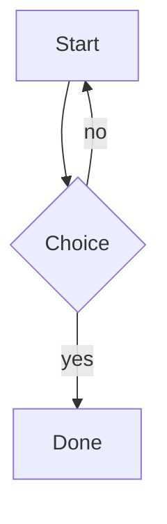
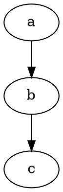

# Opaque render candidates


```mermaid
graph TD
  A[Start] --> B{Choice}
  B -->|yes| C[Done]
  B -->|no| A
```

```math
\int_0^1 x^2 \, dx = \frac{1}{3}
```

Inline math $x^2 + y^2 = z^2$ in prose.

$$
E = mc^2
$$


```dot
digraph G {
  a -> b;
  b -> c;
}
```

Not math: costs $5 and $10 in prose.
